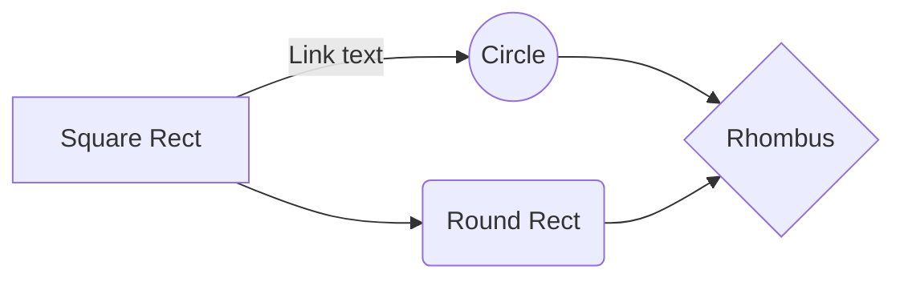
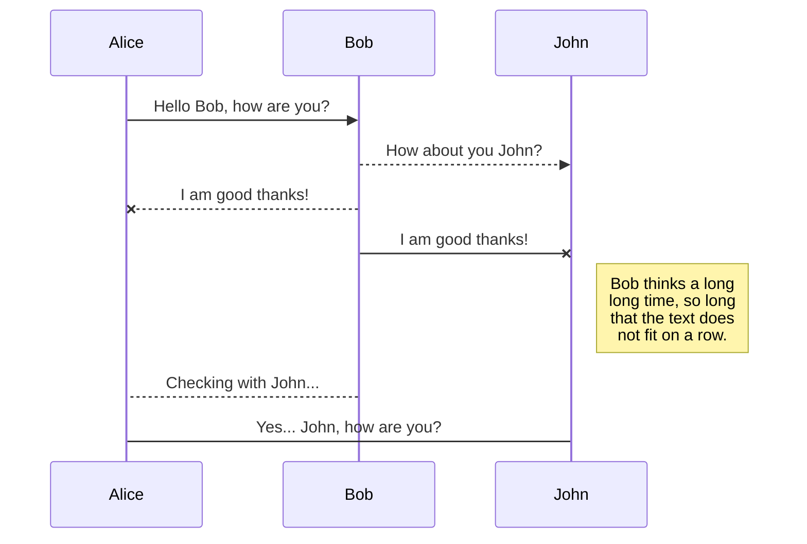

# What is markdown
Markdown  is  a lightweight  markup language 
that is easy  to learn  and use. It is popular for
writing  blog posts, email,  and other types  of 
text-heavy documents. Markdown uses a simple
syntax of punctuation characters and plain-text
formatting,  making it easy to read and write. 
Developer mostly use this in their project 
documentation in Github .
# Markdown-tag
> This > sign is blockquotes   
> For comment in markdown we can just use the html comment <!--- --->
<!--- This is comment --->

> For heading we can use # sign single # for heading 1 double # for heading 2 and so on.
# this is heading 1
## this is heading 2
### this is heading 3

> For horizontal row we can use --- (triple minus sign)

---
this is horizontal line 

>for paragraph you can simple write test with any sign or tag

> for bolding a text you can use ** in the both side of text without any space.

**this is bold text**  
> for italic we can use single * without any space   

*this is italic*

> For table use | (separator sign) for separate column and for horizontal row --- are used

| Name | age | 
|---|---|
| Sazzad | 24 |
| Nur | 23 |
| Obaidur | 22 |

> For link you can use [Link text](link address)

[Google](google.com)

> for image you can just use a !(exclamatory sign)

> for flowchart 

> For diagram 

>Also some mathematical sign can be generated
